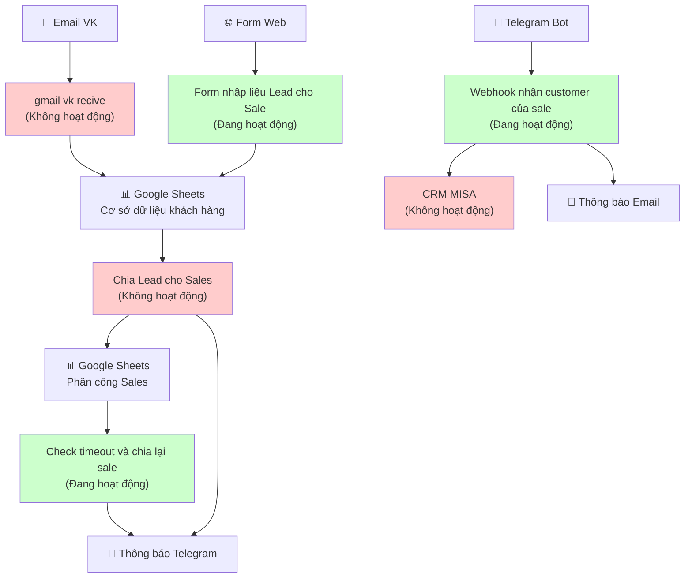
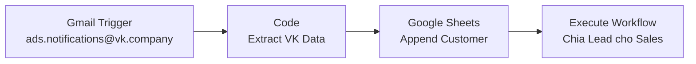
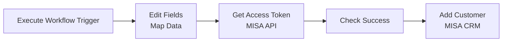
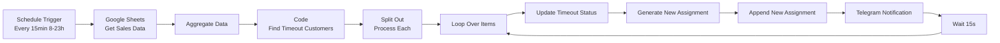
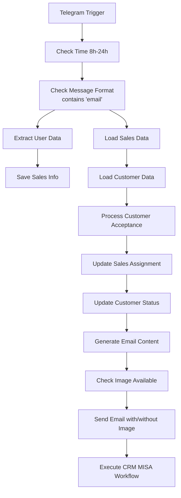
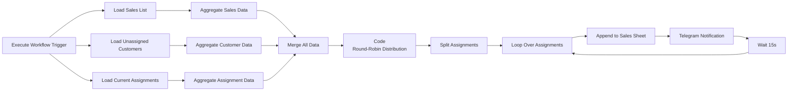
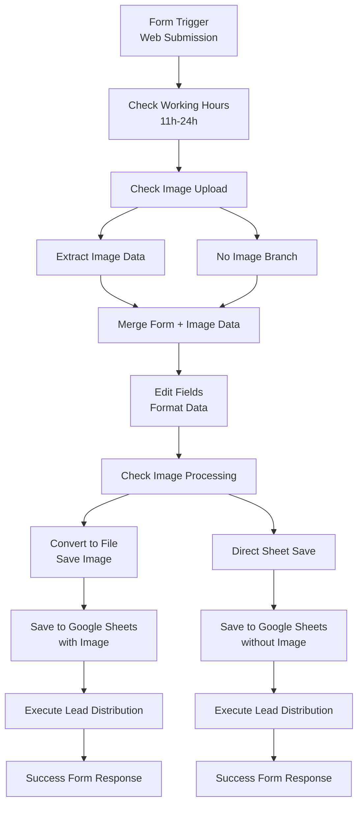
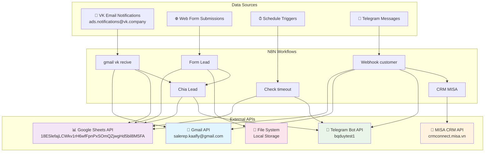

# 📋 TÀI LIỆU BÀN GIAO HỆ THỐNG N8N WORKFLOWS

## 🚀 1. TỔNG QUAN

### 📊 Danh sách tất cả workflows

| STT | Tên Workflow | ID | Trạng thái | Mục đích |
|-----|--------------|----| -------|----------|
| 1 | **gmail vk recive** | quRchZWWhXqkCFMb | ❌ Không hoạt động | Tự động nhận và xử lý email từ VK ads, chuyển thành lead |
| 2 | **CRM MISA** | HqR787bN7UiHGTgo | ❌ Không hoạt động | Đồng bộ thông tin khách hàng vào hệ thống CRM MISA |
| 3 | **Check timeout và chia lại sale** | 76y5IHa4MLBji61I | ✅ Đang hoạt động | Kiểm tra timeout khách hàng và tự động chia lại cho sale khác |
| 4 | **Webhook nhận customer của sale** | w3YZ32WqRDPDkHor | ✅ Đang hoạt động | Xử lý việc sale nhận khách hàng qua Telegram |
| 5 | **Chia Lead cho Sales** | xCCKfrXANJxMuyfw | ❌ Không hoạt động | Tự động phân chia lead cho các sales theo thuật toán round-robin |
| 6 | **Form nhập liệu Lead cho Sale** | OyRnbzTDnhXo4wr6 | ✅ Đang hoạt động | Form web nhập thông tin khách hàng mới |

### 🔗 Sơ đồ quan hệ giữa workflows



### 🎯 Luồng hoạt động chính

1. **Thu thập Lead**: 
   - Email từ VK ads → `gmail vk recive` (❌ Không hoạt động)
   - Form web → `Form nhập liệu Lead cho Sale` (✅ Đang hoạt động)

2. **Phân chia Lead**: 
   - `Chia Lead cho Sales` (❌ Không hoạt động) → Google Sheets

3. **Quản lý Timeout**: 
   - `Check timeout và chia lại sale` (✅ Đang hoạt động) → Tự động chia lại

4. **Sales nhận việc**: 
   - `Webhook nhận customer của sale` (✅ Đang hoạt động) → Telegram Bot

5. **Đồng bộ CRM**: 
   - `CRM MISA` (❌ Không hoạt động) → API MISA

---

## 📝 2. CHI TIẾT TỪNG WORKFLOW

### 2.1. 📧 gmail vk recive

**Thông tin:**
- **Tên Workflow**: gmail vk recive
- **ID**: quRchZWWhXqkCFMb  
- **Trạng thái**: ❌ Không hoạt động
- **Loại kích hoạt**: Gmail Trigger (Kiểm tra mỗi phút)
- **Mục đích chi tiết**: Tự động nhận email từ VK ads (ads.notifications@vk.company), trích xuất thông tin khách hàng và chuyển vào Google Sheets, sau đó kích hoạt workflow chia lead

**Sơ đồ luồng:**


**Phân tích các Node:**
| Node | Loại | Chức năng | Đầu vào | Đầu ra | Cấu hình |
|------|------|----------|-------|--------|--------|
| Gmail Trigger | gmailTrigger | Theo dõi email VK | Thông báo email VK | Nội dung email | Kiểm tra mỗi phút, lọc người gửi |
| Code | code | Trích xuất dữ liệu khách hàng | Văn bản email | Dữ liệu khách hàng có cấu trúc | Mẫu regex cho phone, email, link mạng xã hội |
| Append row in sheet | googleSheets | Lưu vào cơ sở dữ liệu | Dữ liệu khách hàng | Xác nhận sheet | Google Sheets API, Sheet ID: 18ESlefajLCWkv1rH6wfFpnPxSOmQZjwgHd5bil8M5FA |
| Execute Workflow | executeWorkflow | Kích hoạt phân phối lead | - | - | Workflow ID: xCCKfrXANJxMuyfw |

**Phụ thuộc:**
- **API/Dịch vụ ngoài**: Gmail API, Google Sheets API
- **Workflow khác**: Chia Lead cho Sales (xCCKfrXANJxMuyfw)
- **Thông tin xác thực sử dụng**: 
  - Gmail OAuth2: salerep.kaafly@gmail.com
  - Google Service Account: bqduy192

---

### 2.2. 🏢 CRM MISA

**Thông tin:**
- **Tên Workflow**: CRM MISA
- **ID**: HqR787bN7UiHGTgo
- **Trạng thái**: ❌ Không hoạt động  
- **Loại kích hoạt**: Execute Workflow Trigger (Được gọi bởi workflow khác)
- **Mục đích chi tiết**: Đồng bộ thông tin khách hàng từ Google Sheets vào hệ thống CRM MISA thông qua API

**Sơ đồ luồng:**


**Phân tích các Node:**
| Node | Loại | Chức năng | Đầu vào | Đầu ra | Cấu hình |
|------|------|----------|-------|--------|--------|
| Execute Workflow Trigger | executeWorkflowTrigger | Nhận dữ liệu khách hàng | Đối tượng khách hàng | Dữ liệu đã mapping | Đầu vào: data object |
| Edit Fields | set | Mapping trường khách hàng | Dữ liệu thô khách hàng | Định dạng MISA có cấu trúc | Mapping trường cho MISA API |
| GetAccessToken | httpRequest | Xác thực MISA | Thông tin client | Access token | POST tới MISA Account API |
| Check Success | if | Xác thực token | Phản hồi API | Boolean | Kiểm tra cờ thành công |
| Add Customer | httpRequest | Tạo khách hàng | Dữ liệu khách hàng + token | Phản hồi API | POST tới MISA Customers API |

**Phụ thuộc:**
- **API/Dịch vụ ngoài**: MISA CRM API (crmconnect.misa.vn)
- **Workflow khác**: Được gọi từ "Webhook nhận customer của sale"
- **Thông tin xác thực sử dụng**: MISA API credentials (TestAPI1)

---

### 2.3. ⏰ Check timeout và chia lại sale

**Thông tin:**
- **Tên Workflow**: Check timeout và chia lại sale
- **ID**: 76y5IHa4MLBji61I
- **Trạng thái**: ✅ Đang hoạt động
- **Loại kích hoạt**: Schedule Trigger (Cron: 0,15,30,45 8-23 * * *)
- **Mục đích chi tiết**: Kiểm tra các khách hàng đã được phân cho sale nhưng quá 15 phút chưa nhận, tự động chuyển sang sale tiếp theo

**Sơ đồ luồng:**


**Phân tích các Node:**
| Node | Loại | Chức năng | Đầu vào | Đầu ra | Cấu hình |
|------|------|----------|-------|--------|--------|
| Schedule Trigger | scheduleTrigger | Kích hoạt định thời | - | Timestamp | Cron: 0,15,30,45 8-23 * * * |
| Google Sheets | googleSheets | Đọc dữ liệu sales | - | Dữ liệu phân công sales | Sheet: Sales Customers |
| Code (Timeout Check) | code | Tìm khách hàng timeout | Dữ liệu sales | Khách hàng timeout | Logic timeout 15 phút |
| Update timeout | googleSheets | Đánh dấu timeout | Dữ liệu khách hàng | Xác nhận cập nhật | Cập nhật trạng thái thành "Timeout" |
| Code (Reassign) | code | Tính toán sale tiếp theo | Khách hàng timeout + danh sách sales | Phân công mới | Thuật toán round-robin |
| Telegram Notification | telegram | Thông báo phân công lại | Dữ liệu phân công | Tin nhắn đã gửi | Chat ID: -4803648973 |

**Phụ thuộc:**
- **API/Dịch vụ ngoài**: Google Sheets API, Telegram Bot API
- **Workflow khác**: Không có (bộ lập lịch độc lập)
- **Thông tin xác thực sử dụng**: 
  - Google Service Account: bqduy192
  - Telegram API: bqduytest1

---

### 2.4. 📱 Webhook nhận customer của sale

**Thông tin:**
- **Tên Workflow**: Webhook nhận customer của sale
- **ID**: w3YZ32WqRDPDkHor
- **Trạng thái**: ✅ Đang hoạt động
- **Loại kích hoạt**: Telegram Trigger (Bot webhook)
- **Mục đích chi tiết**: Xử lý tin nhắn từ Telegram khi sales nhận khách hàng (format: /Y <mã_khách_hàng>), cập nhật database và gửi email thông tin khách hàng

**Sơ đồ luồng:**


**Phân tích các Node:**
| Node | Loại | Chức năng | Đầu vào | Đầu ra | Cấu hình |
|------|------|----------|-------|--------|--------|
| Telegram Trigger | telegramTrigger | Lắng nghe tin nhắn bot | Cập nhật Telegram | Dữ liệu tin nhắn | Bot webhook |
| If (Time Check) | if | Xác thực giờ làm việc | Giờ hiện tại | Boolean | Kiểm tra >= 8 AM |
| Code (Process) | code | Xác thực và xử lý chấp nhận | Tin nhắn + Dữ liệu | Kết quả đã xử lý | Xác thực lệnh /Y |
| Update Sheets | googleSheets | Cập nhật trạng thái khách hàng | Dữ liệu khách hàng | Xác nhận cập nhật | Nhiều thao tác sheet |
| Code (Email) | code | Tạo nội dung email | Thông tin khách hàng | HTML email | Template email phong phú |
| Gmail Send | gmail | Gửi email thông báo | Nội dung email | Xác nhận đã gửi | Gmail API |
| Execute Workflow | executeWorkflow | Đồng bộ vào CRM | Dữ liệu khách hàng | - | Gọi CRM MISA workflow |

**Phụ thuộc:**
- **API/Dịch vụ ngoài**: Telegram Bot API, Google Sheets API, Gmail API
- **Workflow khác**: CRM MISA (HqR787bN7UiHGTgo)
- **Thông tin xác thực sử dụng**:
  - Telegram: bqduytest1
  - Gmail OAuth2: Gmail account
  - Google Service Account: bqduy192

---

### 2.5. 🔄 Chia Lead cho Sales

**Thông tin:**
- **Tên Workflow**: Chia Lead cho Sales
- **ID**: xCCKfrXANJxMuyfw
- **Trạng thái**: ❌ Không hoạt động
- **Loại kích hoạt**: Execute Workflow Trigger (Called by other workflows)
- **Mục đích chi tiết**: Phân chia khách hàng chưa được nhận cho các sales theo thuật toán round-robin, đảm bảo phân phối đều

**Sơ đồ luồng:**


**Phân tích các Node:**
| Node | Loại | Chức năng | Đầu vào | Đầu ra | Cấu hình |
|------|------|----------|-------|--------|--------|
| Execute Workflow Trigger | executeWorkflowTrigger | Nhận kích hoạt | - | Tín hiệu kích hoạt | Đầu vào thụ động |
| Load Sales/Customers | googleSheets | Đọc nguồn dữ liệu | - | Dữ liệu sheet | Nhiều thao tác sheet |
| Code (Distribution) | code | Thuật toán round-robin | Tất cả dữ liệu | Khách hàng được phân công | Logic phân phối thông minh |
| Split Out | splitOut | Xử lý từng cái một | Mảng phân công | Phân công cá nhân | Tách để xử lý |
| Append Sales Assignment | googleSheets | Lưu phân công | Dữ liệu phân công | Xác nhận sheet | Sheet phân công sales |
| Telegram Notification | telegram | Thông báo phân công | Thông tin phân công | Tin nhắn đã gửi | Chat ID: -4803648973 |

**Phụ thuộc:**
- **API/Dịch vụ ngoài**: Google Sheets API, Telegram Bot API
- **Workflow khác**: Được gọi bởi "gmail vk recive" và "Form nhập liệu Lead cho Sale"
- **Thông tin xác thực sử dụng**:
  - Google Service Account: bqduy192
  - Telegram API: bqduytest1

---

### 2.6. 📝 Form nhập liệu Lead cho Sale

**Thông tin:**
- **Tên Workflow**: Form nhập liệu Lead cho Sale
- **ID**: OyRnbzTDnhXo4wr6
- **Trạng thái**: ✅ Đang hoạt động
- **Loại kích hoạt**: Form Trigger (Web form submission)
- **Mục đích chi tiết**: Form web để nhập thông tin khách hàng mới, có thể upload ảnh, tự động lưu vào database và trigger phân chia lead

**Sơ đồ luồng:**


**Phân tích các Node:**
| Node | Loại | Chức năng | Đầu vào | Đầu ra | Cấu hình |
|------|------|----------|-------|--------|--------|
| Form Trigger | formTrigger | Giao diện form web | Form submissions | Dữ liệu form + files | Form phong phú với dropdown |
| If (Working Hours) | if | Xác thực thời gian | Giờ hiện tại | Boolean | Kiểm tra >= 11 AM |
| Extract from File | extractFromFile | Xử lý ảnh được upload | Dữ liệu ảnh binary | Metadata ảnh | Chuyển đổi binary to property |
| Edit Fields | set | Định dạng dữ liệu khách hàng | Dữ liệu form thô | Dữ liệu có cấu trúc | Mapping và định dạng trường |
| Convert to File | convertToFile | Chuẩn bị ảnh để lưu trữ | Dữ liệu ảnh | File binary | Chuyển đổi file |
| Read/Write Files | readWriteFile | Lưu ảnh vào disk | File binary | Đường dẫn file | Lưu trữ file system |
| Google Sheets | googleSheets | Lưu bản ghi khách hàng | Dữ liệu khách hàng | Xác nhận sheet | Database khách hàng |
| Execute Workflow | executeWorkflow | Kích hoạt phân phối | - | - | Gọi phân phối lead |
| Form Response | form | Phản hồi người dùng | - | Tin nhắn hoàn thành | Tin nhắn thành công/thất bại |

**Phụ thuộc:**
- **API/Dịch vụ ngoài**: Google Sheets API, File System
- **Workflow khác**: Chia Lead cho Sales (xCCKfrXANJxMuyfw)
- **Thông tin xác thực sử dụng**: Google Service Account: bqduy192

---

## 🌐 3. BẢN ĐỒ TÍCH HỢP

### 3.1 Tất cả hệ thống bên ngoài



### 3.2 Chi tiết API Endpoints

| Dịch vụ | Endpoint | Phương thức | Cách sử dụng | Workflows |
|---------|----------|--------|-------|-----------|
| **Gmail API** | Gmail Trigger | GET | Theo dõi thông báo email VK | gmail vk recive |
| **Gmail API** | Send Email | POST | Gửi thông tin khách hàng cho sales | Webhook customer |
| **Google Sheets** | Read Sheets | GET | Tải khách hàng, sales, phân công | Tất cả workflows |
| **Google Sheets** | Append Rows | POST | Thêm bản ghi mới | gmail vk recive, Form Lead |
| **Google Sheets** | Update Rows | PUT | Cập nhật trạng thái khách hàng | Check timeout, Webhook customer |
| **MISA CRM** | /api/v2/Account | POST | Lấy access token | CRM MISA |
| **MISA CRM** | /api/v2/Customers | GET | Liệt kê khách hàng | CRM MISA |
| **MISA CRM** | /api/v2/Customers | POST | Tạo khách hàng | CRM MISA |
| **Telegram Bot** | Webhook | POST | Nhận tin nhắn | Webhook customer |
| **Telegram Bot** | Send Message | POST | Gửi thông báo | Check timeout, Chia Lead |

### 3.3 Kết nối cơ sở dữ liệu

#### Cấu trúc Google Sheets:
```
Document ID: 18ESlefajLCWkv1rH6wfFpnPxSOmQZjwgHd5bil8M5FA

📊 Sheet "0" (Customers Database):
├── Chủ Sở hữu
├── Mã KH (Customer Code)
├── Email cá nhân
├── Điện thoại (*) / Điện thoại 2 (*)
├── Hình Thức MKt (*) / Nguồn Marketing (*) / Kênh Marketing (*)
├── Ảnh
├── Trạng thái (Status)
├── Người nhận
├── Họ tên
├── Link MXH
└── Ghi chú

📊 Sheet "842238210" (Sales List):
├── sale (Username)
├── Ngày (Date)
└── [Other sales info]

📊 Sheet "1360010736" (Sales Assignments):
├── Ngày (Date)
├── Sale (Username)
├── Mã KH (Customer Code)
├── Nguồn Marketing (*)
├── Trạng thái (Status)
├── Giờ phân phối (Distribution Time)
├── Ghi chú (Notes)
└── row_number

📊 Sheet "1883368587" (Sales Info):
├── user id (Telegram User ID)
├── First Name / Last Name / Username
└── Email sale
```

---

## ⚙️ 4. HƯỚNG DẪN TRIỂN KHAI

### 4.1 Biến môi trường cần thiết

```bash
# N8N Configuration
N8N_HOST=localhost
N8N_PORT=5678
N8N_PROTOCOL=http

# Database Configuration (if using external DB)
DB_TYPE=postgresdb
DB_HOST=localhost
DB_PORT=5432
DB_NAME=n8n
DB_USERNAME=n8n_user
DB_PASSWORD=your_password

# Security
N8N_ENCRYPTION_KEY=your_32_character_encryption_key
JWT_SECRET=your_jwt_secret_key

# Email Configuration (for notifications)
N8N_EMAIL_MODE=smtp
N8N_SMTP_HOST=smtp.gmail.com
N8N_SMTP_PORT=587
N8N_SMTP_USER=your_email@gmail.com
N8N_SMTP_PASS=your_app_password
```

### 4.2 Cài đặt thông tin xác thực

#### 📧 Cài đặt Gmail OAuth2:
1. Truy cập Google Cloud Console
2. Tạo project và kích hoạt Gmail API
3. Tạo OAuth 2.0 credentials
4. Cấu hình authorized redirect URIs: `http://localhost:5678/rest/oauth2-credential/callback`
5. Trong N8N: Thêm Gmail OAuth2 credential với Client ID/Secret

#### 📊 Google Sheets Service Account:
1. Tạo service account trong Google Cloud Console
2. Tải file JSON key
3. Chia sẻ Google Sheet với email service account
4. Trong N8N: Thêm Google Service Account credential với JSON key

#### 🏢 MISA CRM API:
```json
{
  "client_id": "TestAPI1",
  "client_secret": "Vw3bxNeOF9K7JpJ0qY2jH3jUb7nFOdoAEVH8LNxKBjg=",
  "base_url": "https://crmconnect.misa.vn"
}
```

#### 📱 Telegram Bot:
1. Tạo bot qua @BotFather
2. Lấy bot token
3. Cấu hình webhook URL trong N8N
4. Thêm bot vào các nhóm Telegram mong muốn

### 4.3 Thứ tự thực hiện

1. **Cài đặt hạ tầng**: Cài đặt N8N, cấu hình database
2. **Import Workflows**: Import tất cả 6 file JSON
3. **Cấu hình thông tin xác thực**: Cài đặt tất cả API credentials
4. **Kiểm tra kết nối**: Xác minh tất cả kết nối API bên ngoài
5. **Cấu hình Form**: Cài đặt webhook URL cho web form
6. **Kích hoạt Workflows**: Bật các workflow đang hoạt động theo thứ tự:
   - Form nhập liệu Lead cho Sale
   - Check timeout và chia lại sale  
   - Webhook nhận customer của sale
7. **Kiểm tra luồng hoàn chỉnh**: Gửi form test → xác minh phân phối → test chấp nhận

---

## 🛠️ 5. VẬN HÀNH

### 5.1 Cách chạy thủ công

#### Phân phối Lead thủ công:
```bash
# Execute Chia Lead cho Sales workflow
curl -X POST http://localhost:5678/webhook/test/chia-lead \
  -H "Content-Type: application/json"
```

#### Kiểm tra Timeout thủ công:
```bash
# Execute Check timeout workflow  
curl -X POST http://localhost:5678/webhook/test/check-timeout \
  -H "Content-Type: application/json"
```

#### Gửi Form thủ công:
Truy cập URL form: `http://localhost:5678/form/customer-input`

### 5.2 Điểm giám sát

#### 📊 Các chỉ số chính cần giám sát:
- **Tỷ lệ xử lý Lead**: Số form được gửi mỗi giờ
- **Thành công phân phối**: % lead được phân bổ thành công
- **Tỷ lệ Timeout**: % khách hàng bị timeout
- **Thời gian phản hồi Sales**: Thời gian trung bình để chấp nhận khách hàng
- **Sức khỏe API**: Thời gian phản hồi Gmail/Sheets/MISA API
- **Tỷ lệ lỗi**: Số lần thực thi workflow thất bại

#### 🚨 Cảnh báo quan trọng:
- Vượt quá quota Gmail API
- Lỗi Google Sheets API
- Lỗi kết nối MISA CRM  
- Telegram bot không phản hồi
- Lỗi thực thi workflow
- Tỷ lệ timeout cao (>20%)

### 5.3 Các lỗi thường gặp & Cách khắc phục

#### 📧 Vấn đề Gmail:
```
Lỗi: "Gmail API quota exceeded"
Khắc phục: Tăng quota hoặc thực hiện rate limiting
```

```
Lỗi: "Authentication failed"  
Khắc phục: Refresh OAuth2 tokens trong credentials
```

#### 📊 Vấn đề Google Sheets:
```
Lỗi: "The caller does not have permission"
Khắc phục: Chia sẻ sheet với email service account
```

```
Lỗi: "Quota exceeded"
Khắc phục: Thực hiện exponential backoff retry logic
```

#### 🏢 Vấn đề MISA CRM:
```
Lỗi: "Authentication failed"
Khắc phục: Xác minh client_id và client_secret
```

```
Lỗi: "Customer already exists"
Khắc phục: Thực hiện logic kiểm tra trùng lặp
```

#### 📱 Vấn đề Telegram:
```
Lỗi: "Bot was blocked by user"
Khắc phục: User cần unblock bot thủ công
```

```
Lỗi: "Webhook timeout"
Khắc phục: Tối ưu hiệu suất workflow
```

#### ⏰ Vấn đề Timeout:
```
Lỗi: "Too many timeouts"
Khắc phục: Kiểm tra tính khả dụng của sales và giờ làm việc
```

```
Lỗi: "Round-robin logic fails"
Khắc phục: Xác minh tính toàn vẹn dữ liệu danh sách sales
```

### 5.4 Sao lưu & Khôi phục

#### Sao lưu hàng ngày:
- Export tất cả cấu hình workflow
- Sao lưu dữ liệu Google Sheets
- Lưu execution logs
- Lưu trữ credentials (mã hóa)

#### Quy trình khôi phục:
1. **Khôi phục Workflow**: Re-import file JSON
2. **Khôi phục Dữ liệu**: Khôi phục từ bản sao lưu Google Sheets
3. **Khôi phục Credential**: Khôi phục từ bản sao lưu đã mã hóa
4. **Kiểm tra Sức khỏe**: Chạy test executions

---

## 📞 THÔNG TIN LIÊN HỆ HỖ TRỢ

- **Quản trị viên N8N**: [Thông tin liên hệ của bạn]
- **Quản trị viên Google Workspace**: [Thông tin liên hệ của bạn]  
- **Quản trị viên MISA CRM**: [Thông tin liên hệ của bạn]
- **Quản trị viên Telegram Bot**: [Thông tin liên hệ của bạn]

---

## 📝 LỊCH SỬ THAY ĐỔI

| Ngày | Phiên bản | Thay đổi | Tác giả |
|------|---------|---------|--------|
| 2025-01-10 | 1.0 | Tài liệu ban đầu | Ezbase.vn |

---

*Tài liệu này được tạo tự động từ analysis các workflow N8N hiện tại. Cập nhật thường xuyên khi có thay đổi.*

